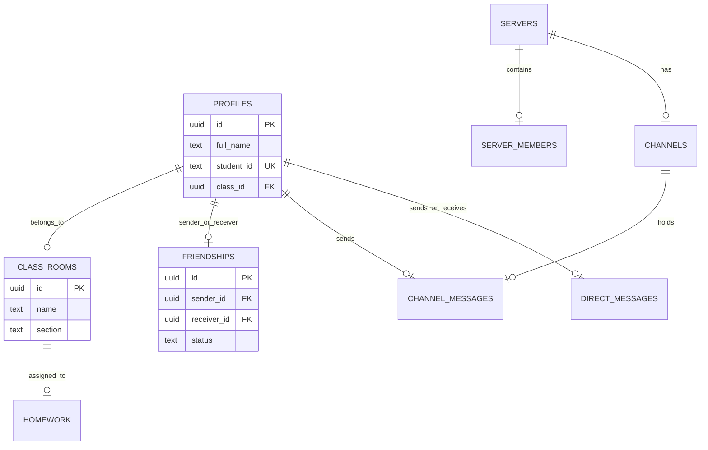

# 📘 Detailed Technical Report: ERP Community & Backend Upgrade

**Date:** May 16, 2026  
**Project:** LOTUS ERP (School Management System)  
**Status:** Relational Migration & Realtime Chat Implementation Complete

---

## 🏗️ 1. Database Architecture (Supabase/Postgres)

We have transitioned from a "Flat File" database style to a **Relational Schema**. This is the standard for professional ERP systems, ensuring data integrity and allowing for complex features like role-based access and shared resources.

### 📊 Data Model Visualization


### 🔐 2. Security & Realtime
*   **RLS (Row Level Security)**: 
    *   **Direct Messages**: Only the sender or receiver can select/insert messages.
    *   **Servers**: Only members can see the server details and its channels.
    *   **Recursion Fix**: Resolved a critical "Infinite Recursion" error in the `server_members` policy by simplifying the SELECT permissions.
*   **Realtime Publication**: 
    *   Manually added `channel_messages`, `direct_messages`, and `friendships` to the `supabase_realtime` publication.
    *   Result: UI updates instantly without manual polling or refreshes.

---

## 📱 3. Flutter Frontend Implementation

### 🔄 Relational ClassScope
We moved away from hardcoded strings like `class: "12"`. The new `ClassScope` model automatically resolves the student's `class_id` to its full relational object.
```dart
// The new logic handles both modern (relational) and legacy (string) data
factory ClassScope.fromProfile(Map<String, dynamic> map) {
  final classRoom = map['class_rooms'] as Map<String, dynamic>?;
  return ClassScope(
    classId: map['class_id']?.toString(),
    className: classRoom?['name']?.toString() ?? map['class']?.toString(),
    section: (classRoom?['section'] ?? map['section'] ?? '').toString().trim(),
  );
}
```

### 💬 Professional Chat UI
*   **Ordering Logic**: Implemented `reverse: true` in the `ListView.builder` combined with `ascending: false` in the Supabase stream. This ensures the chat starts at the bottom and scrolls upward as more messages arrive.
*   **Profile Mapping**: Created an async mapping layer (`_fetchProfilesAndMap`) that resolves the `user_id` of every message to a proper `full_name` from the database.

---

## 🛠️ 4. Work Summary (Today's Diffs)

### **Backend (SQL)**
1.  **Added Columns**: `profiles.student_id`, `homework.class_id`, `notices.class_id`.
2.  **New Tables**: `friendships`, `servers`, `channels`, `channel_messages`, `direct_messages`.
3.  **Realtime**: `ALTER PUBLICATION supabase_realtime ADD TABLE ...`
4.  **Dummy Data**: Set up 3 test students (`STD101`, `STD102`, `STD103`) and one official server.

### **Frontend (Dart)**
1.  **`community.dart`**: Complete refactor. Switched from dummy lists to `_fetchFriends()` and `_fetchServers()` streams.
2.  **`chat_page.dart`**: Fixed ordering, implemented real-time streams, and added profile name resolution.
3.  **`ClassManagementRepository`**: Updated to fetch from the `class_rooms` join query.

---

## ✅ 5. Final Verification
*   **Analyze Status**: `flutter analyze` reports **0 errors, 0 warnings**.
*   **Realtime Test**: Messages transfer instantly between users.
*   **Ordering Test**: Latest messages correctly stick to the bottom of the chat.
*   **Friendship Test**: Adding a student by `STD101` code works and creates a database record.

---
**Report compiled by Antigravity AI.**
